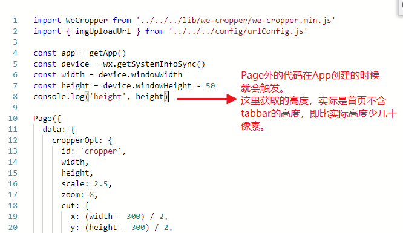

1、微信小程序码仅仅针对线上，开发版与体验版扫码会提示该小程序未发布。
测试小程序码的方法：
- 设置编译模式参数测试小程序码
如配置url：pages/index/index?scene=6430277129069593265，scene为小程序码[B接口](https://developers.weixin.qq.com/miniprogram/dev/api/qrcode.html)所带参数（多参数可自定义符号分割，长度不可超过32个字符）
```
onLoad (options) {
  // 这里就可以拿到小程序码中的参数6430277129069593265
  console.log('二维码进入', decodeURIComponent(options.scene)
}    
```
- 直接将生成的二维码通过开发者工具的‘二维码编译’解析出来（虽然这种方式是最好的选择，但自己尝试解析不出来，全部都跳转了首页）

###### 所以不建议在第一个版本小程序就上线小程序码功能，可在第一个版本预留页面，在onLoad中预先写好测试代码，以供后续版本调试小程序码使用，确保下次上线小程序码一次成功。

2、iOS端，page中开启了下拉刷新，又使用了 toast / loading，下拉刷新时页面会有一个很大的回弹动作，解决方法为去掉微信的toast / loading或自己写loadinng弹框。


3、canvas等元素使用的是App原生组件 不支持 overflow:hidden，具体见[这里](https://developers.weixin.qq.com/blogdetail?action=get_post_info&docid=0006c6618607c07989f6acd015b000&highline=overflow)

4、小程序不易打开过多页面，目前页面路径最多只能打开十层。

5、小程序测试支付需要扫生成的二维码，而且后台设置金额total_fee单位为分（int），否则报错‘缺少支付total_fee’。

6、获取设备高度问题  
